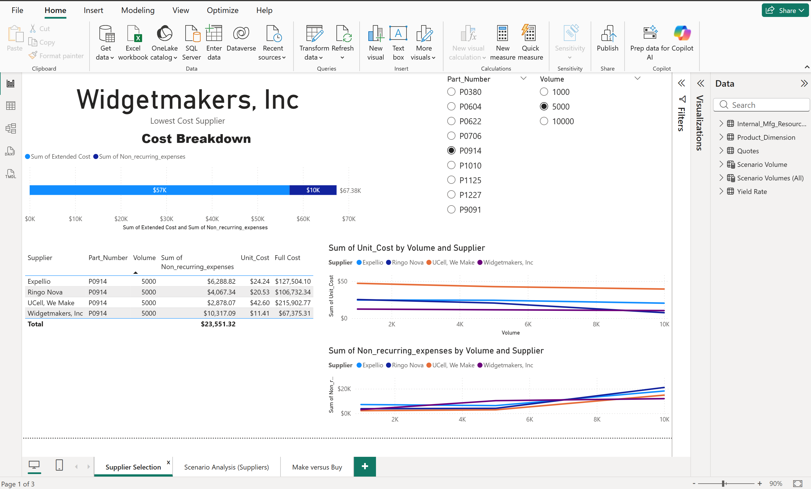
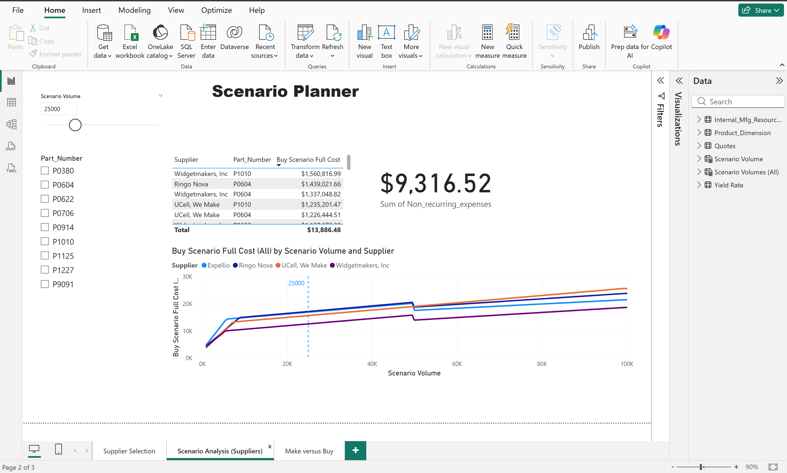
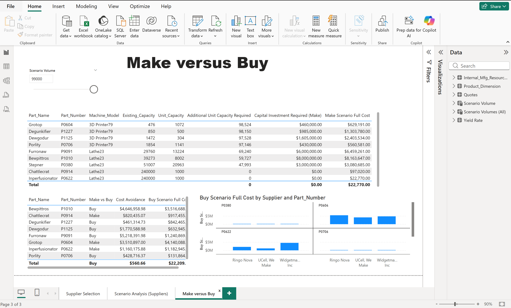

# Supply Chain Cost Analysis using Power BI

## Project Overview
Tenate Industries is a company that sells replacement parts for industrial pizza ovens and works with multiple suppliers to source its components. Each supplier offers a different cost structure, influenced by order volume, cost components, and product quality.

This project explores *supplier quotes* data to understand how differences in volume, cost structure, and quality affect total costs across suppliers. The analysis provides a clearer view of key factors that need to be considered during the supplier selection process.

## Project Objectives
- Examine cost differences between suppliers across various order volumes  
- Observe how the lowest-cost supplier changes under different volume scenarios  
- Understand the impact of cost structure and supplier quality on effective costs  

## Dataset Overview
- *Supplier quotes* data by product and volume  
- Cost components include **unit cost** and **non-recurring expenses**  
- Supplier quality assumptions (*yield*) are incorporated into the analysis  
- Total cost calculations are used as the basis for data exploration and visualization  

## Key Outputs & Insights

### 1. Lowest Cost Supplier by Volume

- The analysis shows that suppliers with the lowest **unit cost** do not always result in the lowest **total cost**
- The most cost-efficient supplier can change as order volume varies  

**Key insight:**  
Order volume plays an important role in determining the most cost-efficient supplier.

### 2. Cost Structure Comparison

- Total cost is influenced by a combination of **unit cost** and **non-recurring expenses**
- Suppliers with higher fixed costs tend to be less competitive at lower volumes, but may become more efficient at higher volumes  

**Key insight:**  
Cost structure should be evaluated holistically, not based on unit price alone.

### 3. Quality-Adjusted Cost

- Differences in supplier quality (*yield*) affect the effective cost outcome
- Suppliers with lower yields result in higher effective costs  

**Key insight:**  
Quality considerations can significantly alter cost comparisons between suppliers.

## Key Learnings
- Understanding how volume, cost structure, and quality influence cost comparisons  
- Using visualization as a tool to explore and interpret data  
- Connecting analytical outputs to business decision context in a simple way  
- Identifying key insights without adding unnecessary assumptions or complexity  

## Tools
- Power BI

## Disclaimer
This project was created for learning purposes only.
The dataset is sourced from DataCamp Case Studies and does not represent real business conditions.
All analyses and insights are based on simulated data for educational use.
